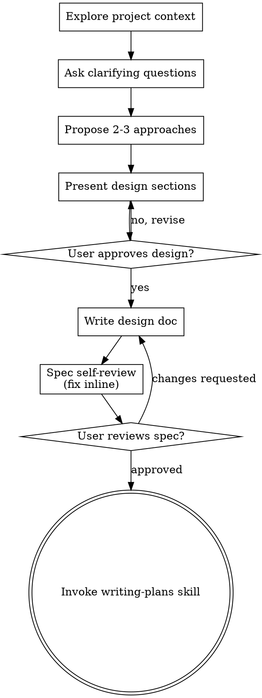

# 把點子腦力激盪成設計

透過自然的協作對話，幫助把點子變成完整的設計與規格。

先理解目前的專案上下文，然後一次一個問題地提問，逐步精煉點子。一旦你了解要建構什麼，就呈現設計並取得使用者核准。

<HARD-GATE>
在你呈現設計且使用者核准之前，不要呼叫任何實作技能、撰寫任何程式碼、搭建任何專案、或採取任何實作行動。這適用於每個專案，無論它看似多麼簡單。
</HARD-GATE>

## 反模式：「這太簡單了，不需要設計」

每個專案都要走過這個流程。待辦清單、單一函式的工具、設定變更——全部都是。「簡單」的專案正是未經檢視的假設造成最多浪費工作的地方。設計可以很短（對真正簡單的專案而言，幾句話就夠），但你必須呈現它並取得核准。

## 檢查清單

你必須為以下每一項建立一個任務，並依序完成它們：

1. **探索專案上下文** ——檢查檔案、文件、最近的 commits
2. **在適當時機提供視覺夥伴** ——不是在一開始。當某個問題確實「展示」會比「描述」更清楚時（首次出現時），在那時提供它（獨立一則訊息）；核准後它的瀏覽器分頁會為你開啟。若從未出現視覺問題，就永遠不要提供它。見下方「視覺夥伴」一節。
3. **提出釐清問題** ——一次一個，理解目的／約束／成功準則
4. **提出 2-3 種做法** ——附上取捨與你的建議
5. **呈現設計** ——以配合其複雜度的段落呈現，每個段落後取得使用者核准
6. **撰寫設計文件** ——儲存到 `docs/superpowers/specs/YYYY-MM-DD-<topic>-design.md` 並 commit
7. **規格自我審查** ——快速就地檢查佔位符、矛盾、歧義、範圍（見下方）
8. **使用者審查書面規格** ——繼續前請使用者審查規格檔案
9. **轉入實作** ——呼叫 writing-plans 技能以建立實作計畫

## 流程圖

**終點狀態是呼叫 writing-plans。** 不要呼叫 frontend-design、mcp-builder 或任何其他實作技能。brainstorming 之後你唯一會呼叫的技能是 writing-plans。

## 流程

**理解點子：**

- 先查看目前專案狀態（檔案、文件、最近的 commits）
- 在提出詳細問題之前，先評估範圍：若請求描述多個獨立子系統（例如「建立一個含聊天、檔案儲存、帳單與分析的平台」），立刻標示出來。不要花問題去精煉一個需要先拆解的專案的細節。
- 若專案大到無法塞進單一規格，幫助使用者拆解成子專案：獨立的片段有哪些、它們如何關聯、應以什麼順序建構？然後以正常設計流程腦力激盪第一個子專案。每個子專案都有自己的規格 → 計畫 → 實作循環。
- 對範圍適當的專案，一次一個問題地提問，逐步精煉點子
- 盡可能偏好選擇題，但開放式問題也可以
- 每則訊息只有一個問題——若某個主題需要更多探索，把它拆成多個問題
- 聚焦於理解：目的、約束、成功準則

**探索做法：**

- 提出 2-3 種不同的做法並附上取捨
- 以對話方式呈現選項，附上你的建議與理由
- 以你建議的選項開頭並解釋原因
- 無情地 YAGNI——從每個做法與設計中移除不必要的功能

**呈現設計：**

- 一旦你相信你了解要建構什麼，就呈現設計
- 每個段落配合其複雜度調整篇幅：直截了當則幾句話，細膩處則 200-300 字
- 每個段落後詢問目前看起來是否正確
- 涵蓋：架構、元件、資料流、錯誤處理、測試
- 準備好在某些內容不合理時回頭釐清

**為隔離與清晰而設計：**

- 把系統拆成更小的單元，每個單元有單一清楚的目的、透過定義良好的介面溝通、並能被獨立理解與測試
- 對每個單元，你應該能回答：它做什麼、你如何使用它、它依賴什麼？
- 有人能在不讀內部實作的情況下理解一個單元做什麼嗎？你能在不破壞使用者的情況下變更內部實作嗎？若不行，邊界需要調整。
- 更小、邊界良好的單元對你也更容易處理——你最擅長推理能一次完整放入上下文的程式碼，而檔案保持聚焦時你的編輯也更可靠。當檔案變大時，那往往是它做太多的訊號。

**在既有程式庫中工作：**

- 在提出變更前先探索目前的結構。遵循既有模式。
- 在既有程式碼有影響此工作的問題處（例如檔案成長過大、邊界不明確、職責纏繞），把有針對性的改善納入設計——以一位優秀開發者改善其所處程式碼的方式。
- 不要提出無關的重構。保持聚焦於服務目前目標的事物。

## 設計之後

**文件：**

- 把經驗證的設計（規格）寫到 `docs/superpowers/specs/YYYY-MM-DD-<topic>-design.md`
  - （使用者對規格位置的偏好會覆寫此預設值）
- 若可用，使用 elements-of-style:writing-clearly-and-concisely 技能
- 把設計文件 commit 到 git

**規格自我審查：**
寫完規格文件後，以全新的眼光檢視它：

1. **佔位符掃描：** 有任何「TBD」、「TODO」、未完成的區段、或含糊的需求嗎？修正它們。
2. **內部一致性：** 有區段互相矛盾嗎？架構符合功能描述嗎？
3. **範圍檢查：** 它是否夠聚焦以成為單一實作計畫，還是需要拆解？
4. **歧義檢查：** 有任何需求能被兩種不同方式解讀嗎？若是，選一個並讓它明確。

就地修正任何問題。不需要重新審查——直接修正並繼續。

**使用者審查關卡：**
規格審查迴圈通過後，在繼續前請使用者審查書面規格：

> 「規格已寫好並 commit 到 `<path>`。請審查它，並在我們開始撰寫實作計畫之前讓我知道你是否想做任何修改。」

等待使用者的回應。若他們要求修改，就修改並重跑規格審查迴圈。只有使用者核准後才繼續。

**實作：**

- 呼叫 writing-plans 技能以建立詳細的實作計畫
- 不要呼叫任何其他技能。writing-plans 是下一步。

## 視覺夥伴

一個以瀏覽器為基礎的夥伴，用於在腦力激盪期間展示 mockups、圖表與視覺選項。它以工具的形式提供——不是一種模式。接受這個夥伴表示它可用於受益於視覺化處理的問題；並不代表每個問題都要透過瀏覽器。

**提供夥伴（在適當時機）：** 不要在一開始提供它。等到某個問題確實「展示」會比「說明」更清楚時——一個真正的 mockup／佈局／圖表問題，而不只是 UI *主題*。首次發生時，在那時提供它，作為獨立一則訊息：
> 「這一段用展示的可能更容易——我可以在進行時於瀏覽器分頁中組合 mockups、圖表與比較。它還是很新，而且可能很耗 tokens。要我這樣做嗎？我會為你開啟它。」

**這個提議必須是獨立一則訊息。** 只有提議——沒有釐清問題、摘要或其他內容。等待使用者的回應。若他們接受，用 `--open` 啟動伺服器，讓他們的瀏覽器自動開啟到第一個畫面。若他們婉拒，繼續純文字模式，且除非他們主動提起，否則不再提供。

**逐問題決定：** 即使使用者接受後，仍要為每個問題決定使用瀏覽器或終端機。判斷標準：**使用者「看」會比「讀」更容易理解嗎？**

- **內容本質上就是視覺的，使用瀏覽器** ——mockups、線框圖、佈局比較、架構圖、並排的視覺設計
- **內容是文字的，使用終端機** ——需求問題、概念選擇、取捨清單、A/B/C/D 文字選項、範圍決策

關於 UI 主題的問題不自動是視覺問題。「個性在此情境下意味著什麼？」是概念問題——使用終端機。「哪個精靈佈局更好？」是視覺問題——使用瀏覽器。

若他們同意使用夥伴，在繼續前先讀詳細指南：
`skills/brainstorming/visual-companion.md`
