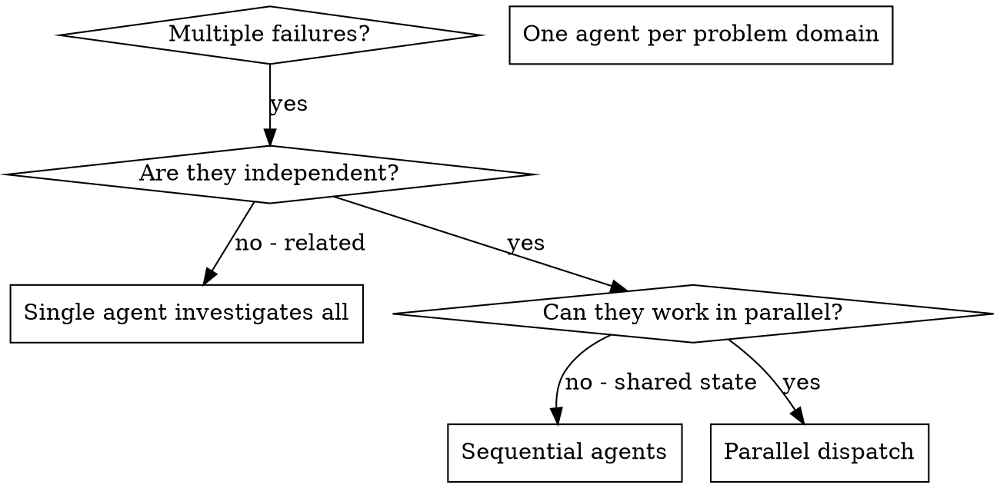

# 派發並行代理

## 總覽

你將任務委派給具備隔離上下文的專門代理。透過精確構思它們的指令與上下文，你確保它們能保持專注並成功完成任務。它們不應繼承你 session 的上下文或歷史 —— 你為它們建構所需的全部內容。這也為協調工作保留了你的上下文。

當你有多個互不相關的失敗（不同的測試檔、不同的子系統、不同的 bug）時，逐一調查會浪費時間。每次調查都彼此獨立，可以並行進行。

**核心原則：** 每個獨立的問題領域派發一個代理，讓它們並行運作。

## 何時使用



**使用時機：**
- 3 個以上測試檔因不同根因而失敗
- 多個子系統各自獨立損壞
- 每個問題無需依賴其他問題的上下文即可理解
- 各調查之間沒有共享狀態

**不要使用的時機：**
- 失敗彼此相關（修好一個可能連帶修好其他）
- 需要理解完整的系統狀態
- 代理會互相干擾

## 模式

### 1. 識別獨立的問題領域

按損壞的內容對失敗分組：
- 檔案 A 測試：工具核准流程
- 檔案 B 測試：批次完成行為
- 檔案 C 測試：中止功能

每個領域彼此獨立 —— 修正工具核准不會影響中止測試。

### 2. 建立聚焦的代理任務

每個代理會收到：
- **明確範圍：** 單一測試檔或子系統
- **清楚目標：** 讓這些測試通過
- **限制：** 不要更動其他程式碼
- **預期輸出：** 你發現與修正內容的摘要

### 3. 並行派發

在同一則回應中發出全部三個子代理派發 —— 它們會並行執行：

```text
Subagent (general-purpose): "Fix agent-tool-abort.test.ts failures"
Subagent (general-purpose): "Fix batch-completion-behavior.test.ts failures"
Subagent (general-purpose): "Fix tool-approval-race-conditions.test.ts failures"
# All three run concurrently.
```

一則回應中多次派發呼叫 = 並行執行。每則回應一次 = 循序執行。

### 4. 審查與整合

當代理回報時：
- 閱讀每份摘要
- 確認修正彼此不衝突
- 執行完整的測試套件
- 整合所有變更

## 代理 Prompt 結構

良好的代理 prompt 具備：
1. **聚焦** - 單一清晰的問題領域
2. **自足** - 包含理解問題所需的全部上下文
3. **明確輸出** - 代理應該回傳什麼？

```markdown
Fix the 3 failing tests in src/agents/agent-tool-abort.test.ts:

1. "should abort tool with partial output capture" - expects 'interrupted at' in message
2. "should handle mixed completed and aborted tools" - fast tool aborted instead of completed
3. "should properly track pendingToolCount" - expects 3 results but gets 0

These are timing/race condition issues. Your task:

1. Read the test file and understand what each test verifies
2. Identify root cause - timing issues or actual bugs?
3. Fix by:
   - Replacing arbitrary timeouts with event-based waiting
   - Fixing bugs in abort implementation if found
   - Adjusting test expectations if testing changed behavior

Do NOT just increase timeouts - find the real issue.

Return: Summary of what you found and what you fixed.
```

## 常見錯誤

**❌ 範圍過大：** 「修好所有測試」- 代理會迷失方向
**✅ 具體明確：** 「修好 agent-tool-abort.test.ts」- 範圍聚焦

**❌ 沒有上下文：** 「修正競爭條件」- 代理不知道在哪裡
**✅ 提供上下文：** 貼上錯誤訊息與測試名稱

**❌ 沒有限制：** 代理可能重構一切
**✅ 設定限制：** 「不要更動正式程式碼」或「只修正測試」

**❌ 輸出含糊：** 「修好它」- 你不知道改了什麼
**✅ 具體明確：** 「回傳根因與變更的摘要」

## 何時不該使用

**相關失敗：** 修好一個可能連帶修好其他 —— 先一起調查
**需要完整上下文：** 必須檢視整個系統才能理解
**探索式除錯：** 你尚不知道哪裡壞了
**共享狀態：** 代理會互相干擾（編輯相同檔案、使用相同資源）

## 實際會話範例

**情境：** 大型重構後 3 個檔案共 6 個測試失敗

**失敗：**
- agent-tool-abort.test.ts：3 個失敗（時序問題）
- batch-completion-behavior.test.ts：2 個失敗（工具未執行）
- tool-approval-race-conditions.test.ts：1 個失敗（執行次數 = 0）

**決策：** 獨立領域 —— 中止邏輯、批次完成、競爭條件各自獨立

**派發：**
```
Agent 1 → Fix agent-tool-abort.test.ts
Agent 2 → Fix batch-completion-behavior.test.ts
Agent 3 → Fix tool-approval-race-conditions.test.ts
```

**結果：**
- Agent 1：以事件驅動等待取代 timeout
- Agent 2：修正事件結構 bug（threadId 放錯位置）
- Agent 3：新增等待非同步工具執行完成

**整合：** 所有修正彼此獨立、無衝突，完整測試套件全綠

## 驗證

代理回報後：
1. **審查每份摘要** - 了解變更了什麼
2. **檢查衝突** - 代理是否編輯了相同的程式碼？
3. **執行完整套件** - 確認所有修正能共同運作
4. **抽樣檢查** - 代理可能犯系統性錯誤
