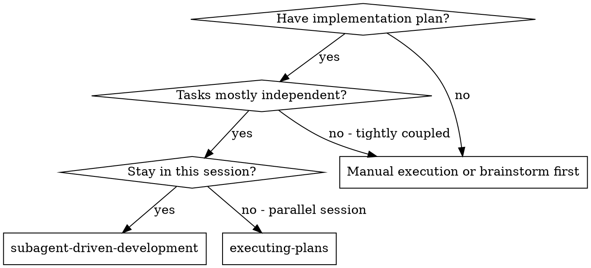
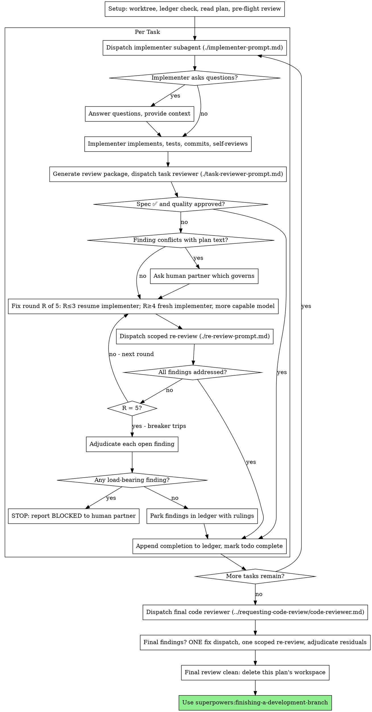

# 子代理驅動開發

執行計畫時，每個任務派出全新的實作子代理，每個任務後進行一次任務審查（規格符合度 + 程式碼品質），最後再進行一次全面的整支分支審查。

**為何使用子代理：** 你將任務委派給擁有獨立上下文的專業代理。透過精準打造他們的指令與上下文，你確保他們能保持專注並成功完成任務。他們不該繼承你的 session 上下文或歷史——由你精確建構他們所需的內容。這也保留你自己的上下文用於協調工作。

**核心原則：** 每個任務全新的子代理 + 任務審查（規格 + 品質）+ 全面的最終審查 = 高品質、快速迭代

**敘事：** 在工具呼叫之間，最多敘述一行簡短文字——記錄簿與工具結果本身就承載了紀錄。

**持續執行：** 不要在任務之間暫停與你的真人夥伴確認。不間斷地執行計畫中的所有任務。唯一需要停下來的理由：你無法解決的 BLOCKED 狀態、真正阻礙進展的歧義、或所有任務皆已完成。「我該繼續嗎？」這類提示與進度摘要都在浪費他們的時間——他們要求你執行計畫，就去執行。

## 使用時機



**vs. 執行計畫（平行 session）：**
- 同一 session（無上下文切換）
- 每個任務全新的子代理（無上下文污染）
- 每個任務後審查（規格符合度 + 程式碼品質），最後全面審查
- 迭代更快（任務之間無需人為介入）

## 流程



## 設定

確保工作在隔離的工作區中進行：使用
superpowers:using-git-worktrees 建立或驗證現有的 worktree。
未經你的真人夥伴明確同意，絕不要在 main/master 分支上開始實作。

對話記憶無法在壓縮後存活。在真實 session 中，
失去進度的控制器曾重新派出整段已完成任務的序列——這是觀察到的最昂貴的單一失敗。
將進度追蹤在記錄簿檔案中，而不只是 todos。

- 每個計畫擁有自己的工作區：技能開始時，執行本技能的
  `scripts/sdd-workspace PLAN_FILE`——它會印出該計畫的 git-ignore 目錄
  （`<repo-root>/.superpowers/sdd/<plan-basename>/`），作為本計畫所有產物
  （記錄簿、簡報、報告、審查套件）的所在。其他計畫的目錄永遠不該由你讀寫。
- 檢查本計畫的記錄簿位於 `<workspace>/progress.md`。若其第一行
  指名你的計畫檔案，凡帶有 `Task <N>: complete` 行的任務皆已完成
  ——不要重新派出它們；從第一個沒有該行的任務繼續。任務的最後一行
  若是修正輪次，表示它處於迴圈中：從下一輪繼續該迴圈。記錄簿的第一行
  指名不同的計畫檔案——或一個遺留在舊扁平路徑 `.superpowers/sdd/progress.md` 的
  零散記錄簿——是其他計畫的進度：讓它留在原地，自己新建一份。
- 以記錄簿的身分作為第一行建立它：`# SDD ledger — plan: <plan file path>`。
- 記錄簿是你的復原地圖：它所指名的 commit 在 git 中確實存在，即使你的上下文
  已不再記得建立過它們。壓縮後，信任記錄簿與 `git log` 勝過你自己的記憶。
- `git clean -fdx` 會摧毀工作區（它是 git-ignore 的暫存區）；若發生這種情況，
  可從 `git log` 復原。

將計畫讀一遍，記下它的上下文與全域約束（Global Constraints），並為每個任務建立一個 todo。

派出任務 1 之前，先掃描計畫一次以找出衝突：

- 互相矛盾、或與計畫的全域約束相抵觸的任務
- 計畫明確要求、但審查評分標準視為缺陷的內容（一個不主張任何斷言的測試、逐字重複的邏輯區塊）

將你發現的一切以一則批次問題呈現給你的真人夥伴——每個發現附上規定它的計畫文字，
詢問何者為準——並且在執行開始前一次問完，而不是在計畫途中每次發現就中斷一次。
若掃描結果乾淨，直接進行，無需多言。審查迴圈仍是用來攔截那些只有實作時才會浮現的衝突的網。

## 模型選擇

使用能勝任每個角色、但功耗最低的模型，以節省成本並提升速度。

**機械式實作任務**（獨立的函式、清楚的規格、1-2 個檔案）：使用快速、便宜的模型。當計畫規格明確時，大多數實作任務都是機械式的。

**整合與判斷任務**（多檔案協調、模式比對、除錯）：使用標準模型。

**架構與設計任務**：使用現有最強的模型。
最終的整支分支審查屬於此類——請用現有最強的模型派出它，而非 session 預設值。

**審查任務**：選擇具有同等判斷力的模型，並依 diff 的大小、複雜度與風險調整。
小的機械式 diff 不需要最強的模型；細微的並行變更則需要。小修正 diff 的限定範圍重審採用便宜到中階的層級。

**修正迴圈升級（第 4-5 輪）**：使用至少比卡住的實作子代理高一階的模型。

**派出子代理時務必明確指定模型。** 未指定模型會繼承你 session 的模型——通常是最強、最貴的——這會靜默地毀掉本節的用意。

**回合數勝過 token 價格。** 牆鐘時間與上下文成本會隨子代理花費的回合數增加，
而最便宜的模型在多步驟工作上通常會花 2-3 倍的回合——總成本反而更高。對審查者、
以及以文字描述為依據的實作者，至少使用中階模型作為底限。
當任務的計畫文字含有完整要寫的程式碼時，實作只是轉錄加上測試：該實作子代理用最便宜的層級。
單一檔案的機械式修正也採用最便宜的層級。

**任務複雜度訊號（實作任務）：**
- 只觸及 1-2 個檔案且有完整規格 → 便宜模型
- 觸及多個檔案且有整合考量 → 標準模型
- 需要設計判斷或廣泛的程式庫理解 → 最強模型

## 任務迴圈

你貼進派發 prompt 的一切——以及子代理回傳的一切——都會留在你的上下文裡直到 session 結束，
並在往後的每個回合被重新讀取。以檔案形式移交產物。

### 1. 派出實作子代理

派發前先記錄 BASE（`git rev-parse HEAD`）——審查套件與修正輪次 diff 需要它。

- **任務簡報：** 派出實作子代理前，執行本技能的
  `scripts/task-brief PLAN_FILE N`——它會將任務全文抽出到一個唯一命名的檔案並印出路徑。
  組合派發內容，讓簡報保持為需求的單一來源。
  你的派發應包含：(1) 一行說明該任務在專案中的定位；(2) 簡報路徑，並以「先讀這個——它就是你的需求，
  其中的確切值請逐字使用」引入；(3) 先前任務所產、簡報無從得知的介面與決策；
  (4) 你對簡報中任何注意到之歧義的裁決；(5) 報告檔案路徑與報告約定。
  確切值（數字、魔術字串、簽名、測試案例）只出現在簡報中。絕不要讓子代理讀整個計畫檔案。
- **報告檔案：** 以簡報命名實作子代理的報告檔案（簡報 `…/task-N-brief.md` → 報告 `…/task-N-report.md`），
  並把它放進派發 prompt 中。實作子代理把完整報告寫在那裡，只回傳狀態、commit、
  一行測試摘要與疑慮。
- 一份派發 prompt 描述一個任務，而非 session 的歷史。不要把先前任務的累積摘要
  （「任務 1-3 之後的狀態」）貼進後來的派發——真實 session 的派發曾達 42k 字元，
  其中 99% 是貼上的歷史。全新的子代理需要它的任務、它所觸及的介面、以及全域約束。其他都不需要。
- 若先前任務在該任務所觸及的領域擱置了一項發現，在派發中帶上指向該記錄簿條目的指標。
- 從派發結果記錄實作子代理的代理身分——修正迴圈的第 1-3 輪會繼續這個代理。
- 絕不平行派出多個實作子代理（會衝突）。

範本：[implementer-prompt.md](implementer-prompt.md)

### 2. 處理回報

實作子代理回報四種狀態之一。依情況分別處理：

**DONE：** 產生審查套件（`scripts/review-package PLAN_FILE BASE HEAD`，從本技能的目錄執行——它會印出
它所寫入的唯一檔案路徑；BASE 是你派發實作子代理前記錄的 commit——絕不是 `HEAD~1`，
那會靜默地丟掉多 commit 任務除最後一筆之外的所有 commit），然後以印出的路徑派出任務審查者。

**DONE_WITH_CONCERNS：** 實作子代理完成了工作但標記了疑慮。繼續前先讀取這些疑慮。
若疑慮關係到正確性或範圍，先在審查前處理。若是觀察性意見（例如「這個檔案越來越大了」），記下並進入審查。

**NEEDS_CONTEXT：** 實作子代理需要未被提供的資訊。補上缺失的上下文並重新派出。

**BLOCKED：** 實作子代理無法完成任務。評估阻礙：
1. 若是上下文問題，提供更多上下文並用同一個模型重新派出
2. 若任務需要更多推理，用更強的模型重新派出
3. 若任務太大，把它拆成更小的片段
4. 若計畫本身有誤，升級給真人處理

**絕不要**忽視升級，或未作任何改變就強迫同一模型重試。若實作子代理說卡住了，勢必有些東西需要改變。

若實作子代理提問——無論開始前或任務中途——清楚且完整地回答，需要時提供額外上下文，
別催促它趕快進入實作。

### 3. 審查任務

每個任務的審查都是任務範圍的關卡。全面審查只在最後的整支分支審查時進行一次。
絕不跳過任務審查，也絕不接受缺少任一判決的回報——規格符合度與任務品質兩者都必須具備。
實作子代理的自我審查永遠無法取代任務審查；兩者都需要。

- 把審查者的 diff 以檔案交付：執行本技能的
  `scripts/review-package PLAN_FILE BASE HEAD`，把印出的檔案路徑交給審查者
  （或不用 bash 時：將 `git log --oneline`、`git diff --stat`、
  與 `git diff -U10`（針對該範圍）重導到一個唯一命名的檔案）。
  輸出永遠不會進入你自己的上下文，而審查者能在一次 Read 呼叫中看到
  commit 清單、統計摘要與含上下文的完整 diff。使用你派發實作子代理前記錄的 BASE——
  絕不是 `HEAD~1`，它會靜默地截斷多 commit 任務。絕不派發沒有 diff 檔案的任務審查者。
- **審查者輸入：** 任務審查者拿到三個路徑——同一個簡報檔案、報告檔案、審查套件——
  以及約束該任務的全域約束。
- 你交給審查者的全域約束區塊是它的注意力透鏡。
  從計畫的全域約束區段或規格逐字複製具約束力的需求：確切值、確切格式、
  以及元件之間陳述的關係（「與 X 相同佈局」、「符合 Y」）。審查者的範本已帶有程序規則
  （YAGNI、測試衛生、審查方法）——約束區塊是給本專案規格所要求的內容。
- 不要無具體的任務相關理由就加入「檢查所有用法」或「若有用就執行競態測試」這類開放式指令
- 不要要求審查者重跑實作子代理已在同一份程式碼上跑過的測試——實作子代理的報告承載測試證據
- 不要替審查者預判發現——絕不可指示審查者忽略或不要標記某個特定問題。若你認為某個發現會是
  誤報，讓審查者提出來，然後在審查迴圈中裁決它。若你正在寫的 prompt 含有「不要標記」、
  「不要把 X 當作缺陷」、「最多 Minor」或「計畫選擇了」——停下來：你在預判，
  通常是為了省掉自己一次審查迴圈。
任務審查者可能回報「⚠️ Cannot verify from diff」項目——即位於未變更程式碼中、或橫跨多個任務的需求。
這些不會阻擋其餘審查，但你在標記任務完成前必須自行逐一解決：你握有審查者欠缺的
計畫與跨任務上下文。若你確認某項是真正的缺口，把它當作一次失敗的規格審查處理——它與其他發現
一起進入修正迴圈。

範本：[task-reviewer-prompt.md](task-reviewer-prompt.md)

### 4. 修正迴圈

當審查回報規格 ❌、任何 Critical 或 Important 發現、或一項你確認是真正缺口的 ⚠️ 項目時，
迴圈觸發。

迴圈開始前，有兩條路線會立刻離開它：

- 邊進行邊把 Minor 發現記錄在進度記錄簿中
  （`Task <N>: minor (deferred): <one-liner>`），並把該清單指給最終的
  整支分支審查，讓它能分流哪些必須在合併前修正。沒人讀的彙總就是靜默的丟棄。Minor 發現
  永不進入迴圈。
- 標示為計畫要求（plan-mandated）的發現——或任何與計畫文字要求衝突的發現——
  是人的決定，如同任何計畫矛盾：呈現發現與計畫文字，詢問何者為準。
  不要因為計畫要求它而駁回該發現，也不要在未詢問的情況下派出與計畫矛盾的修正。
其餘一切進入迴圈。一輪修正 = 一次修正派發加上一次限定範圍的重審。每個任務最多五輪：

**第 1-3 輪——繼續原來的實作子代理。** 把未解決的發現逐字發給它。
它的上下文完好：它知道任務、程式碼與自己的選擇。若你的 harness 無法對一個
仍在運作的子代理再發訊息，就派發一個帶著簡報路徑、報告檔案路徑與發現的全新實作子代理——
無論如何，報告檔案就是持久記憶。

**第 4-5 輪——用更強的模型派發全新實作子代理**（依模型選擇），帶著簡報路徑、報告檔案路徑、
未解決的發現，以及這段框架：「先前的實作子代理嘗試了這個任務 [N] 次；現在由你接手。
讀報告檔案了解試過什麼。」撐過三次續派的迴圈通常代表實作子代理看不到自己的問題——
換一雙新眼睛並提升能力，一次搞定。

**每一輪，無論哪種方式：** 實作子代理修正、重跑覆蓋被修改程式碼的測試、
把修正報告附加到同一份報告檔案，並回傳簡短的狀態約定。重新派發審查者前，確認修正報告
含有覆蓋測試、執行的指令與輸出；三項都齊了才派發重審。在修正訊息中指名的覆蓋測試檔案——
一行修正不需要整個測試套件。

**重審是限定範圍的。** 執行 `scripts/review-package PLAN_FILE FIX_BASE HEAD`，
其中 FIX_BASE 是先前審查所見的 head，並以發現清單、簡報、報告檔案與印出的 diff 路徑
派發 [re-review-prompt.md](re-review-prompt.md)。重審者將每個發現判決為
ADDRESSED 或 NOT ADDRESSED，並且只在修正 diff 中標記新破壞。修正 diff 中的
新 Critical/Important 破壞會加入未解決的發現清單。範圍外的觀察記錄到記錄簿中作為延後的
minor——它們永不延長迴圈。

**每輪結束後，** 附加到記錄簿：
`Task <N>: fix round <R>/5 (<X> addressed, <Y> open — <finding one-liners>; commits <a7>..<b7>)`

絕不在控制器 session 中自己修正發現——你的上下文要保持乾淨以進行協調，
而且控制器的修正會跳過審查。

**斷路器。** 當第 5 輪的重審仍留下未解決的發現時，停止派發。
自行裁決每個未解決的發現——你握有審查者欠缺的計畫與跨任務上下文：

- **審查者錯了，或該點可爭論：** 擱置它——
  `Task <N>: parked — <finding> — ruling: <why the code stands>`。最終審查會看到兩邊。
- **真實存在，但下游沒有東西建構其上：** 以同樣方式擱置，附上說明它真實存在且已延後的裁決。
- **真實且承重**——後續任務建構其上，或它揭露出計畫缺陷：停止。
  附加 `Task <N>: BLOCKED — <reason>` 並向你的真人夥伴回報，附上該發現、
  它碰撞的計畫文字與修正歷史。擱置結構性失敗會讓每個依賴任務都建構其上，
  並把一個連最終審查也修不好的問題交出去。

只在到達上限時裁決。為了結束迴圈而提早裁決，不過是換個名字的預判。每一次裁決都是一條記錄簿
條目——靜默丟棄是禁止的。

### 5. 完成任務

當審查乾淨地回來——或所有未解決的發現都已附上裁決擱置到上限——在同一個訊息中，
與你的其他記帳一起，把完成行附加到記錄簿：

- `Task <N>: complete (commits <base7>..<head7>, review clean)`
- 觸發斷路器後：`Task <N>: complete (commits <base7>..<head7>, <K> parked)`

然後標記 todo 完成並繼續。當審查仍有既未修正、也未在到達上限時附裁決擱置的未解決
Critical/Important 問題時，絕不前往下一個任務。

## 最終審查

最終的整支分支審查也拿到一份套件：執行
`scripts/review-package PLAN_FILE MERGE_BASE HEAD`（MERGE_BASE = 分支開始時的 commit，
例如 `git merge-base main HEAD`），並把印出的路徑包含在最終審查的派發中，
這樣最終審查者讀一個檔案即可，不必用 git 指令重新推導分支 diff。用現有最強的模型派發
（見模型選擇），使用 superpowers:requesting-code-review 的
[code-reviewer.md](../requesting-code-review/code-reviewer.md)。把它指向
記錄簿中延後 minor 與擱置的行，讓它能分流哪些必須在合併前修正。

若最終的整支分支審查回報發現，派發**一個**修正子代理並附上完整的發現清單——而不是每個發現一個修正者。
逐項修正者都會各自重建上下文並重跑測試套件；真實 session 的最終審查修正波成本
超過其所有任務的總和。然後對修正波執行正好一次限定範圍的重審
（在修正範圍上執行 `scripts/review-package PLAN_FILE FIX_BASE HEAD`，
[re-review-prompt.md](re-review-prompt.md)）。
如同任務迴圈的斷路器，裁決任何殘餘發現：附裁決擱置，或在承重的發現上停止。沒有第二次修正波——
殘餘的承重發現會在 finishing-a-development-branch 呈現選項時浮現給你的真人夥伴。

## 收尾

當最終的整支分支審查乾淨、且其修正已合併時，
刪除本計畫的工作區（`rm -rf <workspace>`）——現在 git 歷史就是紀錄。
兄弟目錄屬於其他計畫；讓它們保持原樣。

使用 superpowers:finishing-a-development-branch。

## 常見合理化藉口

| 藉口 | 實情 |
|--------|---------|
| 「規格符合度差不多就好」 | 審查者找到規格缺口 = 尚未完成。修正，或撞上上限並裁決——那是僅有的出口。 |
| 「我自己修就好，派發是額外開銷」 | 控制器修正會污染你的上下文並跳過審查。繼續用原實作子代理。 |
| 「再多一輪就會收斂」 | 超過上限後，輪次不會收斂——失敗是結構性的。裁決並分流。 |
| 「反正審查者總會找出新的東西」 | 限定範圍的重審只驗證修正；它無法游走。未觸及程式碼上的新發現進記錄簿，不進迴圈。 |
| 「這發現顯然錯了，我丟掉它」 | 你只在到達上限時裁決，而每一次裁決都是一條記錄簿條目。靜默丟棄是禁止的。 |
| 「修正很小，跳過重審吧」 | 未經審查的修正正是迴歸登陸的方式。每一輪都以限定範圍的重審結束。 |
| 「審查拖慢了迴圈」 | 沒有審查的迴圈只是未驗證的空轉。審查是迴圈的煞車與方向盤。 |
| 「記錄簿記帳是額外開銷」 | 記錄簿是能在壓縮後存活的東西。沒有它的控制器曾重新派出整段已完成任務的序列。 |

## 範例工作流

```
You: I'm using Subagent-Driven Development to execute this plan.

[Setup: worktree verified]
[Read plan file once: docs/superpowers/plans/feature-plan.md]
[Resolve workspace: scripts/sdd-workspace docs/superpowers/plans/feature-plan.md — no ledger inside, fresh start]
[Create todos for all tasks]

Task 1: Hook installation script

[Run task-brief for Task 1; dispatch implementer with brief + report paths + context]

Implementer: "Before I begin - should the hook be installed at user or system level?"

You: "User level (~/.config/superpowers/hooks/)"

Implementer: [Later]
  - Implemented install-hook command
  - Added tests, 5/5 passing
  - Self-review: Found I missed --force flag, added it
  - Committed

[Run review-package PLAN_FILE BASE HEAD; dispatch task reviewer with the printed path]
Task reviewer: Spec ✅ - all requirements met, nothing extra.
  Strengths: Good test coverage, clean. Issues: None. Task quality: Approved.

[Ledger: Task 1: complete (commits a1b2c3d..d4e5f6a, review clean)]

Task 2: Recovery modes

[Run task-brief for Task 2; dispatch implementer with brief + report paths + context]

Implementer: [No questions]
  - Added verify/repair modes
  - 8/8 tests passing
  - Committed

[Run review-package PLAN_FILE BASE HEAD; dispatch task reviewer with the printed path]
Task reviewer: Spec ❌:
  - Missing: Progress reporting (spec says "report every 100 items")
  Issues (Important): Magic number (100)

[Fix round 1: resume the implementer with both findings]
Implementer: Added progress reporting, extracted PROGRESS_INTERVAL constant.
  Re-ran test/recovery.test.js — 10/10 passing. Fix report appended.

[Run review-package PLAN_FILE FIX_BASE HEAD; dispatch scoped re-review]
Re-reviewer: Missing progress reporting — ADDRESSED (src/recovery.js:41).
  Magic number — ADDRESSED (src/recovery.js:7). New breakage: none.
  Verdict: all findings addressed.

[Ledger: Task 2: fix round 1/5 (2 addressed, 0 open; commits d4e5f6a..b7c8d9e)]
[Ledger: Task 2: complete (commits d4e5f6a..b7c8d9e, review clean)]

...

[After all tasks]
[Run review-package PLAN_FILE MERGE_BASE HEAD; dispatch final code-reviewer, most capable model]
Final reviewer: All requirements met. Deferred minors triaged: none block merge.

[Delete this plan's workspace — the record now lives in git]

Done! Using superpowers:finishing-a-development-branch.
```
