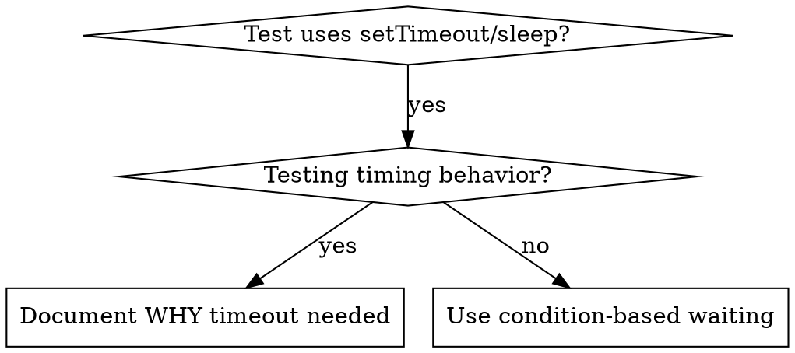

# 條件式等待

## 概述

不穩定的測試常常用任意的延遲來猜測時機。這會造成競態條件：測試在快的機器上通過，但在負載或 CI 下失敗。

**核心原則：** 等待你真正關心的條件，而不是猜測要花多久時間。

## 使用時機



**適用時機：**
- 測試含有任意延遲（`setTimeout`、`sleep`、`time.sleep()`）
- 測試不穩定（有時通過、負載下失敗）
- 並行執行時測試逾時
- 等待非同步操作完成

**不適用時機：**
- 測試真正的時序行為（debounce、throttle 間隔）
- 若使用任意逾時，一定要說明「為什麼」

## 核心模式

```typescript
// ❌ BEFORE: Guessing at timing
await new Promise(r => setTimeout(r, 50));
const result = getResult();
expect(result).toBeDefined();

// ✅ AFTER: Waiting for condition
await waitFor(() => getResult() !== undefined);
const result = getResult();
expect(result).toBeDefined();
```

## 快速模式

| 情境 | 模式 |
|----------|---------|
| 等待事件 | `waitFor(() => events.find(e => e.type === 'DONE'))` |
| 等待狀態 | `waitFor(() => machine.state === 'ready')` |
| 等待數量 | `waitFor(() => items.length >= 5)` |
| 等待檔案 | `waitFor(() => fs.existsSync(path))` |
| 複雜條件 | `waitFor(() => obj.ready && obj.value > 10)` |

## 實作

泛用輪詢函式：
```typescript
async function waitFor<T>(
  condition: () => T | undefined | null | false,
  description: string,
  timeoutMs = 5000
): Promise<T> {
  const startTime = Date.now();

  while (true) {
    const result = condition();
    if (result) return result;

    if (Date.now() - startTime > timeoutMs) {
      throw new Error(`Timeout waiting for ${description} after ${timeoutMs}ms`);
    }

    await new Promise(r => setTimeout(r, 10)); // Poll every 10ms
  }
}
```

本目錄中的 `condition-based-waiting-example.ts` 提供完整實作，內含來自實際除錯 session 的領域特定輔助函式（`waitForEvent`、`waitForEventCount`、`waitForEventMatch`）。

## 常見錯誤

**❌ 輪詢太快：** `setTimeout(check, 1)` —— 浪費 CPU
**✅ 修正：** 每 10ms 輪詢一次

**❌ 沒有逾時：** 條件永遠不成立時會無限迴圈
**✅ 修正：** 永遠要帶逾時，並附上清楚的錯誤

**❌ 資料過期：** 在迴圈前就快取狀態
**✅ 修正：** 在迴圈內呼叫 getter 取得最新資料

## 何時「任意逾時」是正確的

```typescript
// Tool ticks every 100ms - need 2 ticks to verify partial output
await waitForEvent(manager, 'TOOL_STARTED'); // First: wait for condition
await new Promise(r => setTimeout(r, 200));   // Then: wait for timed behavior
// 200ms = 2 ticks at 100ms intervals - documented and justified
```

**條件：**
1. 先等待觸發條件
2. 基於已知的時序（不是猜測）
3. 加上註解說明「為什麼」

## 實際影響

來自除錯 session（2025-10-03）：
- 修好 3 個檔案中 15 個不穩定的測試
- 通過率：60% → 100%
- 執行時間：快了 40%
- 不再有競態條件
