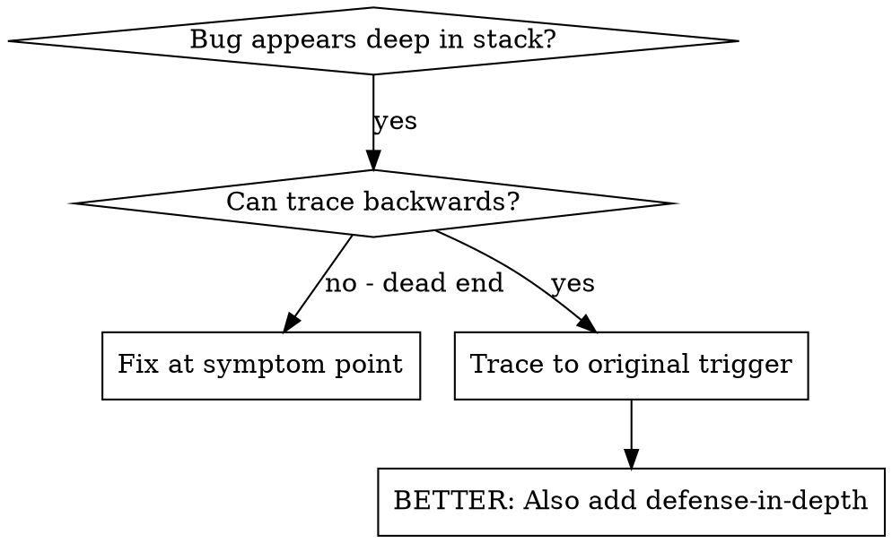
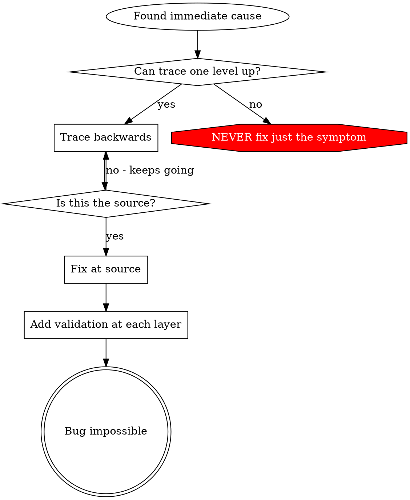

# 根因追蹤

## 概述

Bug 往往在呼叫堆疊深處才顯現（git init 執行在錯誤的目錄、檔案建立到錯誤的位置、資料庫用錯誤的路徑開啟）。直覺會讓你想在錯誤出現的地方修，但那是治標不治本。

**核心原則：** 沿著呼叫鏈一路回溯，直到找到最初的觸發點，然後在源頭修復。

## 使用時機



**適用時機：**
- 錯誤發生在執行過程深處（不是在進入點）
- 堆疊追蹤顯示很長的呼叫鏈
- 不清楚無效資料從哪裡來
- 需要找出是哪個測試/程式碼觸發了問題

## 追蹤流程

### 1. 觀察症狀
```
Error: git init failed in ~/project/packages/core
```

### 2. 找出直接原因
**直接造成這問題的程式碼是什麼？**
```typescript
await execFileAsync('git', ['init'], { cwd: projectDir });
```

### 3. 問：是誰呼叫它的？
```typescript
WorktreeManager.createSessionWorktree(projectDir, sessionId)
  → called by Session.initializeWorkspace()
  → called by Session.create()
  → called by test at Project.create()
```

### 4. 繼續往上追
**傳進來的是什麼值？**
- `projectDir = ''`（空字串！）
- 空字串作為 `cwd` 會解析成 `process.cwd()`
- 那就是原始碼目錄！

### 5. 找出最初的觸發點
**空字串從哪裡來的？**
```typescript
const context = setupCoreTest(); // Returns { tempDir: '' }
Project.create('name', context.tempDir); // Accessed before beforeEach!
```

## 加入堆疊追蹤

當你無法手動追蹤時，加入儀器：

```typescript
// Before the problematic operation
async function gitInit(directory: string) {
  const stack = new Error().stack;
  console.error('DEBUG git init:', {
    directory,
    cwd: process.cwd(),
    nodeEnv: process.env.NODE_ENV,
    stack,
  });

  await execFileAsync('git', ['init'], { cwd: directory });
}
```

**關鍵：** 測試中用 `console.error()`（不要用 logger——可能不會顯示）

**執行並擷取：**
```bash
npm test 2>&1 | grep 'DEBUG git init'
```

**分析堆疊追蹤：**
- 尋找測試檔名
- 找出觸發呼叫的行號
- 識別模式（同一個測試？同一個參數？）

## 找出是哪個測試造成污染

如果測試期間出現某些東西，但你不知道是哪個測試：

使用本目錄中的二分搜尋腳本 `find-polluter.sh`：

```bash
./find-polluter.sh '.git' 'src/**/*.test.ts'
```

它會一個一個跑測試，在第一個污染源停下。用法請見腳本。

## 真實案例：空的 projectDir

**症狀：** `.git` 被建立在 `packages/core/`（原始碼）裡

**追蹤鏈：**
1. `git init` 在 `process.cwd()` 執行 ← 空的 cwd 參數
2. WorktreeManager 收到空的 projectDir
3. Session.create() 傳入空字串
4. 測試在 beforeEach 之前就讀取 `context.tempDir`
5. setupCoreTest() 初始回傳 `{ tempDir: '' }`

**根因：** 頂層變數初始化時讀取了空值

**修復：** 把 tempDir 改成 getter，若在 beforeEach 之前被讀取就丟例外

**同時加入縱深防禦：**
- 第一層：Project.create() 驗證目錄
- 第二層：WorkspaceManager 驗證非空
- 第三層：NODE_ENV 守衛，拒絕在 tmpdir 之外執行 git init
- 第四層：git init 之前記錄堆疊追蹤

## 核心原則



**絕對不要只修錯誤出現的地方。** 回溯找出最初的觸發點。

## 堆疊追蹤小技巧

**測試中：** 用 `console.error()`，不要用 logger——logger 可能被抑制
**操作之前：** 在危險操作「之前」記錄，不要在失敗之後
**包含上下文：** 目錄、cwd、環境變數、時間戳
**擷取堆疊：** `new Error().stack` 會顯示完整的呼叫鏈

## 實際影響

來自除錯 session（2025-10-03）：
- 透過 5 層追蹤找出根因
- 在源頭修復（getter 驗證）
- 加入 4 層防禦
- 1847 個測試全數通過，零污染
