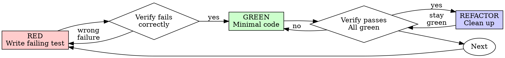

# 測試驅動開發（TDD）

## 總覽

先寫測試。看著它失敗。寫最少的程式碼讓它通過。

**核心原則：** 如果你沒親眼看到測試失敗，你就不知道它測試的是不是對的東西。

**違反規則的字面，就是違反規則的精神。**

## 使用時機

**一律使用：**
- 新功能
- 修 bug
- 重構
- 行為變更

**例外（問你的真人夥伴）：**
- 用完即丟的原型
- 產生的程式碼
- 設定檔

心裡想「這次就跳過 TDD 吧」？停。那就是合理化藉口。

## 鐵律

```
沒有先寫失敗的測試，就不准有正式程式碼
```

在測試之前先寫了程式碼？刪掉。重新開始。

**沒有例外：**
- 不要把它留著當「參考」
- 不要邊寫測試邊「改寫」它
- 不要看它
- 刪掉就是刪掉

從測試開始全新實作。就這樣。

## 紅-綠-重構



### 紅 - 寫失敗的測試

寫一支最小的測試，顯示應該發生什麼事。

<Good>
```typescript
test('retries failed operations 3 times', async () => {
  let attempts = 0;
  const operation = () => {
    attempts++;
    if (attempts < 3) throw new Error('fail');
    return 'success';
  };

  const result = await retryOperation(operation);

  expect(result).toBe('success');
  expect(attempts).toBe(3);
});
```
名稱清楚、測試真實行為、一次只測一件事
</Good>

<Bad>
```typescript
test('retry works', async () => {
  const mock = jest.fn()
    .mockRejectedValueOnce(new Error())
    .mockRejectedValueOnce(new Error())
    .mockResolvedValueOnce('success');
  await retryOperation(mock);
  expect(mock).toHaveBeenCalledTimes(3);
});
```
名稱含糊、測試的是 mock 而不是程式碼
</Bad>

**需求：**
- 一個行為
- 名稱清楚
- 真實程式碼（除非無可避免，否則不用 mock）

### 驗證紅 - 看著它失敗

**強制。絕不可跳過。**

```bash
npm test path/to/test.test.ts
```

確認：
- 測試失敗（不是出錯）
- 失敗訊息符合預期
- 因為功能缺失而失敗（不是打錯字）

**測試通過了？** 你在測試既有的行為。修正測試。

**測試出錯了？** 修正錯誤，重新執行直到它正確地失敗。

### 綠 - 最少程式碼

寫最簡單的程式碼讓測試通過。

<Good>
```typescript
async function retryOperation<T>(fn: () => Promise<T>): Promise<T> {
  for (let i = 0; i < 3; i++) {
    try {
      return await fn();
    } catch (e) {
      if (i === 2) throw e;
    }
  }
  throw new Error('unreachable');
}
```
剛好夠讓它通過
</Good>

<Bad>
```typescript
async function retryOperation<T>(
  fn: () => Promise<T>,
  options?: {
    maxRetries?: number;
    backoff?: 'linear' | 'exponential';
    onRetry?: (attempt: number) => void;
  }
): Promise<T> {
  // YAGNI
}
```
過度設計
</Bad>

不要加功能、不要重構其他程式碼、不要「改良」到測試以外的範圍。

### 驗證綠 - 看著它通過

**強制。**

```bash
npm test path/to/test.test.ts
```

確認：
- 測試通過
- 其他測試仍然通過
- 輸出乾淨（沒有錯誤、警告）

**測試失敗了？** 修程式碼，不是修測試。

**其他測試失敗？** 現在就修。

### 重構 - 清理

只在變綠之後：
- 移除重複
- 改善命名
- 抽取輔助函式

保持測試變綠。不要加行為。

### 重複

為下一個功能寫下一支失敗的測試。

## 好測試

| 品質 | 好 | 壞 |
|---------|------|-----|
| **最小** | 一件事。名稱裡有「and」？拆開它。 | `test('validates email and domain and whitespace')` |
| **清楚** | 名稱描述行為 | `test('test1')` |
| **顯示意圖** | 示範想要的 API | 模糊了程式碼該做什麼 |

寫或修改任何測試時，閱讀 [writing-good-tests.md](writing-good-tests.md) 中讓測試保持誠實的規則：
- 在寫之前，說出會讓測試失敗的正式程式碼變更——在寫它之前
- 斷言真實行為，絕不斷言 mock 行為
- 把僅供測試的程式碼放在測試工具中，別放進正式類別
- 在模擬相依物件之前，先了解它的副作用

## 常見合理化藉口

| 藉口 | 事實 |
|--------|---------|
| 「太簡單了，不用測」 | 簡單的程式碼也會壞。測試只要 30 秒。 |
| 「我之後再測」 | 事後寫的測試會立刻通過——這證明不了任何事。它們可能測錯了東西、測了實作而不是行為，或漏掉了你忘記的邊緣案例。你從沒看過它失敗，所以從沒證明它抓得到 bug。測試優先強迫你面對那個失敗。 |
| 「事後測試也達到同樣目標（精神而非儀式）」 | 事後測試回答的是「這程式碼做什麼？」；測試優先回答的是「這程式碼應該做什麼？」。事後寫的測試被你已經寫的程式碼偏誤——你驗證的是你記得的案例，而不是你會發現的那些。覆蓋率卻沒有證明測試有效。 |
| 「已經手動測過了」 | 手動測試是 ad-hoc：沒有你覆蓋了什麼的紀錄、程式碼變更時無法重跑、壓力下容易忘記案例。「我試過可以用」≠ 全面。自動化測試每次都用相同方式跑。 |
| 「刪掉 X 小時的心血太浪費」 | 沉沒成本謬誤——無論如何那時間都花掉了。真正的選擇是：用 TDD 重寫（高信心）對上保留它然後事後硬補測試（低信心、很可能有 bug）。保留你無法信任的程式碼才是浪費。 |
| 「留著當參考，然後測試優先」 | 你會去改它的。那就是事後測試。刪掉就是刪掉。 |
| 「需要先探索」 | 可以。丟掉探索的產物，用 TDD 重新開始。 |
| 「測試難寫＝設計不清楚」 | 傾聽測試。難測＝難用。 |
| 「TDD 會拖慢我」 | TDD 本身就是務實的路：在 commit 前抓出 bug、防止迴歸、讓你能無所畏懼地重構。「務實」的捷徑意味著在正式環境除錯——更慢，不是更快。 |
| 「手動測試更快」 | 手動測試無法證明邊緣案例。你每次變更都要重測。 |
| 「既有程式碼沒有測試」 | 你正在改善它。為既有程式碼補測試。 |

## 紅旗 - 停，重新開始

- 測試之前先寫了程式碼
- 實作之後才寫測試
- 測試立刻通過
- 說不出測試為何失敗
- 測試「之後」才補
- 合理化「就這次」
- 「我已經手動測過了」
- 「事後測試達到同樣目的」
- 「這是精神不是儀式」
- 「留著當參考」或「改寫既有程式碼」
- 「已經花 X 小時了，刪掉太浪費」
- 「TDD 太教條，我只是務實」
- 「這次不一樣，因為……」

**所有這些都代表：刪掉程式碼。用 TDD 重新開始。**

## 範例：修 bug

**Bug：** 空 email 被接受

**紅**
```typescript
test('rejects empty email', async () => {
  const result = await submitForm({ email: '' });
  expect(result.error).toBe('Email required');
});
```

**驗證紅**
```bash
$ npm test
FAIL: expected 'Email required', got undefined
```

**綠**
```typescript
function submitForm(data: FormData) {
  if (!data.email?.trim()) {
    return { error: 'Email required' };
  }
  // ...
}
```

**驗證綠**
```bash
$ npm test
PASS
```

**重構**
如有需要，抽取多欄位的驗證邏輯。

## 驗證檢查清單

在標記工作完成之前：

- [ ] 每個新函式／方法都有測試
- [ ] 在實作之前看著每個測試失敗
- [ ] 每個測試都以預期的原因失敗（功能缺失，不是打錯字）
- [ ] 為每個測試寫了最少的程式碼讓它通過
- [ ] 所有測試都通過
- [ ] 輸出乾淨（沒有錯誤、警告）
- [ ] 測試使用真實程式碼（除非無可避免，否則不用 mock）
- [ ] 邊緣案例與錯誤都涵蓋

勾不完？你跳過了 TDD。重新開始。

## 卡住時

| 問題 | 解法 |
|---------|----------|
| 不知道怎麼測 | 寫你想要的 API。先寫斷言。問你的真人夥伴。 |
| 測試太複雜 | 設計太複雜。簡化介面。 |
| 什麼都要 mock | 程式碼太耦合。用依賴注入。 |
| 測試設定很龐大 | 抽取輔助函式。還是複雜？簡化設計。 |

## 除錯整合

發現 bug？寫一支重現它的失敗測試。遵循 TDD 循環。測試證明修復並防止迴歸。

絕不沒有測試就修 bug。

## 最終規則

```
正式程式碼 → 測試存在且先失敗過
否則 → 不是 TDD
```

未經你的真人夥伴允許，沒有例外。
