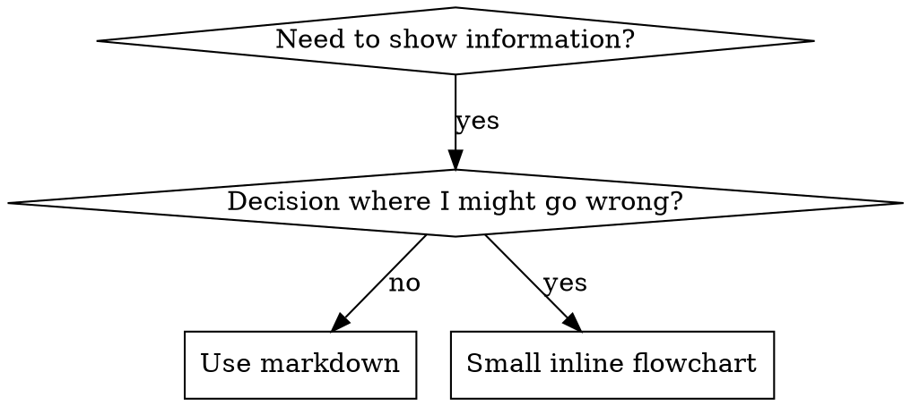

# 撰寫技能

## 總覽

**撰寫技能，就是將測試驅動開發應用於流程文件。**

**個人技能存放於你執行環境的 skills 目錄**（Claude Code 是 `~/.claude/skills/`）——其他執行環境的路徑請見 [codex-tools.md](../using-superpowers/references/codex-tools.md) 或 [gemini-tools.md](../using-superpowers/references/gemini-tools.md)。Codex、Copilot CLI 與 Gemini CLI 也都能辨識 `~/.agents/skills/` 作為跨執行環境的別名。

你撰寫測試案例（搭配子代理的壓力情境）、觀察其失敗（基線行為）、撰寫技能（文件）、觀察測試通過（代理遵從），然後重構（關閉漏洞）。

**核心原則：**如果你沒有看過代理在沒有技能時失敗，你就不會知道該技能是否教對了事情。

**必備背景：**使用本技能前，你必須先理解 superpowers:test-driven-development。該技能定義了根本的紅 → 綠 → 重構循環。本技能將 TDD 應用於文件撰寫。

**官方指引：**關於 Anthropic 官方的技能撰寫最佳實務，請見 anthropic-best-practices.md。該文件提供與本技能 TDD 導向方法互補的額外模式與準則。

## 什麼是技能？

**技能**是針對經過驗證的技術、模式或工具的參考指南。技能幫助未來的代理找到並套用有效的方法。

**技能是：**可重用的技術、模式、工具、參考指南

**技能不是：**關於你曾如何解決某個問題的敘事

## 技能的 TDD 對應

| TDD 概念 | 技能建立 |
|-------------|----------------|
| **測試案例** | 搭配子代理的壓力情境 |
| **實作程式碼** | 技能文件（SKILL.md） |
| **測試失敗（紅）** | 代理在沒有技能時違反規則（基線） |
| **測試通過（綠）** | 代理在有技能時遵從 |
| **重構** | 關閉漏洞同時維持遵從 |
| **先寫測試** | 在撰寫技能前先執行基線情境 |
| **觀察其失敗** | 逐字記錄代理使用的合理化藉口 |
| **最小化程式碼** | 撰寫能針對那些特定違規的技能 |
| **觀察其通過** | 驗證代理現在確實遵從 |
| **重構循環** | 找出新的合理化藉口 → 堵住 → 重新驗證 |

整個技能建立流程都遵循紅 → 綠 → 重構。

## 何時建立技能

**以下情況建立：**
- 技術對你而言並非直覺上顯而易見
- 你會想在跨專案時再次參考它
- 模式適用範圍廣（非專案特定）
- 其他人也會受益

**以下情況不要建立：**
- 一次性解決方案
- 其他地方已有良好文件記載的標準做法
- 專案特定的慣例（放進你的 instructions 檔案）
- 機械性限制（若能用 regex／驗證強制執行，就自動化它——把文件留給需要判斷的情境）

## 技能類型

### 技術
有步驟可循的具體方法（condition-based-waiting、root-cause-tracing）

### 模式
思考問題的方式（flatten-with-flags、test-invariants）

### 參考文件
API 文件、語法指南、工具文件（office docs）

## 目錄結構


```
skills/
  skill-name/
    SKILL.md              # Main reference (required)
    supporting-file.*     # Only if needed
```

**扁平命名空間**——所有技能都在一個可搜尋的命名空間中

**以下內容獨立成檔：**
1. **重量級參考文件**（100 行以上）——API 文件、完整語法
2. **可重用的工具**——腳本、公用程式、範本

**保持內嵌：**
- 原則與概念
- 程式碼模式（50 行以內）
- 其他所有內容

## SKILL.md 結構

**Frontmatter（YAML）：**
- 兩個必填欄位：`name` 和 `description`（所有支援的欄位請見 [agentskills.io/specification](https://agentskills.io/specification)）
- 總長度最多 1024 字元
- `name`：僅使用字母、數字與連字號（不得有括號或特殊字元）
- `description`：以第三人稱撰寫，只描述「何時使用」（而非「做什麼」）
  - 以「Use when...」開頭，聚焦於觸發條件
  - 包含具體的症狀、情境與上下文
  - **絕對不要摘要技能的流程或工作流**（原因見 SDO 小節）
  - 若可能，控制在 500 字元以內

```markdown
---
name: Skill-Name-With-Hyphens
description: Use when [specific triggering conditions and symptoms]
---

# Skill Name

## Overview
What is this? Core principle in 1-2 sentences.

## When to Use
[Small inline flowchart IF decision non-obvious]

Bullet list with SYMPTOMS and use cases
When NOT to use

## Core Pattern (for techniques/patterns)
Before/after code comparison

## Quick Reference
Table or bullets for scanning common operations

## Implementation
Inline code for simple patterns
Link to file for heavy reference or reusable tools

## Common Mistakes
What goes wrong + fixes

## Real-World Impact (optional)
Concrete results
```


## 技能探索最佳化（SDO）

**對探索至關重要：**未來的代理需要「找到」你的技能

### 1. 豐富的 description 欄位

**目的：**你的代理會閱讀 description 來決定要為某個任務載入哪些技能。讓它能回答：「我現在該讀這個技能嗎？」

**格式：**以「Use when...」開頭，聚焦於觸發條件

**關鍵：Description 是「何時使用」，不是「技能做什麼」**

description 應該只描述觸發條件。不要在 description 中摘要技能的流程或工作流。

**為何重要：**測試顯示，當 description 摘要了技能的工作流時，代理可能會照著 description 做，而不去閱讀完整的技能內容。一個寫著「任務之間進行 code review」的 description，會讓代理只做一次審查，即使技能的流程圖明明畫了兩次審查（先規格符合度，再程式碼品質）。

當 description 改成只有「Use when executing implementation plans with independent tasks」（不含工作流摘要）時，代理便正確地閱讀流程圖，並遵循兩階段審查流程。

**陷阱：**摘要工作流的 description 會製造代理必然抄的近路。技能本體變成代理會跳過的文件。

```yaml
# ❌ BAD: Summarizes workflow - agents may follow this instead of reading skill
description: Use when executing plans - dispatches subagent per task with code review between tasks

# ❌ BAD: Too much process detail
description: Use for TDD - write test first, watch it fail, write minimal code, refactor

# ✅ GOOD: Just triggering conditions, no workflow summary
description: Use when executing implementation plans with independent tasks in the current session

# ✅ GOOD: Triggering conditions only
description: Use when implementing any feature or bugfix, before writing implementation code
```

**內容：**
- 使用能指出此技能適用的具體觸發條件、症狀與情境
- 描述*問題本身*（競態條件、不一致行為），而非*特定語言的症狀*（setTimeout、sleep）
- 除非技能本身就是技術特定，否則讓觸發條件保持與技術無關
- 若技能是技術特定的，就在觸發條件中明確標示
- 以第三人稱撰寫（會被注入 system prompt）
- **絕對不要摘要技能的流程或工作流**

```yaml
# ❌ BAD: Too abstract, vague, doesn't include when to use
description: For async testing

# ❌ BAD: First person
description: I can help you with async tests when they're flaky

# ❌ BAD: Mentions technology but skill isn't specific to it
description: Use when tests use setTimeout/sleep and are flaky

# ✅ GOOD: Starts with "Use when", describes problem, no workflow
description: Use when tests have race conditions, timing dependencies, or pass/fail inconsistently

# ✅ GOOD: Technology-specific skill with explicit trigger
description: Use when using React Router and handling authentication redirects
```

### 2. 關鍵字涵蓋

使用代理會搜尋的詞：
- 錯誤訊息：「Hook timed out」、「ENOTEMPTY」、「race condition」
- 症狀：「flaky」、「hanging」、「zombie」、「pollution」
- 同義詞：「timeout/hang/freeze」、「cleanup/teardown/afterEach」
- 工具：實際指令、函式庫名稱、檔案類型

### 3. 具描述性的命名

**使用主動語氣、動詞開頭：**
- ✅ `creating-skills` 而非 `skill-creation`
- ✅ `condition-based-waiting` 而非 `async-test-helpers`

### 4. Tokens 效率（關鍵）

**問題：**getting-started 與常被參考的技能會載入到每一段對話中。每個 tokens 都很重要。

**目標字數：**
- getting-started 工作流：每個 <150 字
- 常被載入的技能：總計 <200 字
- 其他技能：<500 字（仍要簡潔）

**技巧：**

**把細節移到工具說明（--help）：**
```bash
# ❌ BAD: Document all flags in SKILL.md
search-conversations supports --text, --both, --after DATE, --before DATE, --limit N

# ✅ GOOD: Reference --help
search-conversations supports multiple modes and filters. Run --help for details.
```

**使用交叉參考：**
```markdown
# ❌ BAD: Repeat workflow details
When searching, dispatch subagent with template...
[20 lines of repeated instructions]

# ✅ GOOD: Reference other skill
Always use subagents (50-100x context savings). REQUIRED: Use [other-skill-name] for workflow.
```

**壓縮範例：**
```markdown
# ❌ BAD: Verbose example (42 words)
your human partner: "How did we handle authentication errors in React Router before?"
You: I'll search past conversations for React Router authentication patterns.
[Dispatch subagent with search query: "React Router authentication error handling 401"]

# ✅ GOOD: Minimal example (20 words)
Partner: "How did we handle auth errors in React Router?"
You: Searching...
[Dispatch subagent → synthesis]
```

**消除冗餘：**
- 不要重複交叉參考技能裡已有的內容
- 不要解釋從指令就能一目了然的事
- 不要包含同一模式的多個範例

**驗證：**
```bash
wc -w skills/path/SKILL.md
# getting-started workflows: aim for <150 each
# Other frequently-loaded: aim for <200 total
```

**以你「做的事」或核心洞見命名：**
- ✅ `condition-based-waiting` > `async-test-helpers`
- ✅ `using-skills` 而非 `skill-usage`
- ✅ `flatten-with-flags` > `data-structure-refactoring`
- ✅ `root-cause-tracing` > `debugging-techniques`

**動名詞（-ing）很適合流程：**
- `creating-skills`、`testing-skills`、`debugging-with-logs`
- 主動，描述你正在採取的行動

### 5. 交叉參考其他技能

**當撰寫會參考其他技能的文件時：**

只使用技能名稱，並加上明確的必要性標記：
- ✅ 好：`**REQUIRED SUB-SKILL:** Use superpowers:test-driven-development`
- ✅ 好：`**REQUIRED BACKGROUND:** You MUST understand superpowers:systematic-debugging`
- ❌ 差：`See skills/testing/test-driven-development`（不清楚是否必備）
- ❌ 差：`@skills/testing/test-driven-development/SKILL.md`（強制載入，消耗上下文）

**為什麼不用 @ 連結：**`@` 語法會立即強制載入檔案，在你真正需要之前就消耗 200k+ 的上下文。

## 流程圖的使用時機



**只在以下情況使用流程圖：**
- 不明顯的決策點
- 你可能太早停手的流程迴圈
- 「A vs B 何時該用哪個」的決策

**永遠不要用流程圖來處理：**
- 參考資料 → 表格、清單
- 程式碼範例 → Markdown 區塊
- 線性指令 → 編號清單
- 沒有語意意義的標籤（step1、helper2）

graphviz 樣式規則請見本目錄中的 `graphviz-conventions.dot`。

**為你的人类夥伴視覺化：**使用本目錄中的 `render-graphs.js` 將技能的流程圖渲染成 SVG：
```bash
./render-graphs.js ../some-skill           # Each diagram separately
./render-graphs.js ../some-skill --combine # All diagrams in one SVG
```

## 程式碼範例

**一個優質範例勝過多個平庸範例**

選擇最相關的語言：
- 測試技巧 → TypeScript/JavaScript
- 系統除錯 → Shell/Python
- 資料處理 → Python

**好的範例：**
- 完整且可執行
- 有良好註解說明「為什麼」
- 來自真實情境
- 清楚展示模式
- 可立即套用（不是泛用範本）

**不要：**
- 用 5 種以上語言實作
- 建立填空式範本
- 寫刻意造作的範例

你擅長移植——一個好範例就夠了。

## 檔案組織

### 自足的技能
```
defense-in-depth/
  SKILL.md    # Everything inline
```
適用時機：所有內容都能容納，不需要重量級參考文件

### 含可重用工具的技能
```
condition-based-waiting/
  SKILL.md    # Overview + patterns
  example.ts  # Working helpers to adapt
```
適用時機：工具是可重用的程式碼，而不只是敘述

### 含重量級參考文件的技能
```
pptx/
  SKILL.md       # Overview + workflows
  pptxgenjs.md   # 600 lines API reference
  ooxml.md       # 500 lines XML structure
  scripts/       # Executable tools
```
適用時機：參考資料太大無法內嵌

## 鐵則（與 TDD 相同）

```
NO SKILL WITHOUT A FAILING TEST FIRST
```

這適用於新技能與對既有技能的修改。

在測試之前先寫了技能？刪掉它。重新開始。
未經測試就修改技能？同樣的違規。

**沒有例外：**
- 不適用於「簡單的增補」
- 不適用於「只是加個小節」
- 不適用於「文件更新」
- 不要把未測試的修改當「參考文件」留著
- 不要在跑測試時「順便調整」
- 刪除就是刪除

**必備背景：**superpowers:test-driven-development 技能解釋了這為何重要。同樣的原則也適用於文件。

## 測試所有技能類型

不同類型的技能需要不同的測試方法：

### 紀律執行類技能（規則／需求）

**範例：**TDD、verification-before-completion、designing-before-coding

**測試方式：**
- 學術式提問：他們理解規則嗎？
- 壓力情境：他們在壓力下會遵從嗎？
- 多重壓力組合：時間 + 沉沒成本 + 疲勞
- 找出合理化藉口並加入明確的反制

**成功準則：**代理在最大壓力下遵循規則

### 技術類技能（how-to 指南）

**範例：**condition-based-waiting、root-cause-tracing、defensive-programming

**測試方式：**
- 應用情境：他們能正確套用該技術嗎？
- 變異情境：他們能處理邊界情況嗎？
- 資訊缺漏測試：指令有缺口嗎？

**成功準則：**代理能成功將技術套用在新情境

### 模式類技能（心智模型）

**範例：**reducing-complexity、information-hiding 概念

**測試方式：**
- 辨識情境：他們能辨識模式何時適用嗎？
- 應用情境：他們能使用這個心智模型嗎？
- 反例：他們知道何時「不該」套用嗎？

**成功準則：**代理能正確判斷何時／如何套用模式

### 參考文件類技能（文件／API）

**範例：**API 文件、指令參考、函式庫指南

**測試方式：**
- 檢索情境：他們能找到正確資訊嗎？
- 應用情境：他們能正確使用找到的資訊嗎？
- 缺口測試：常見使用案例都有涵蓋嗎？

**成功準則：**代理能找到並正確套用參考資訊

## 跳過測試的常見合理化藉口

| 藉口 | 現實 |
|--------|---------|
| 「技能顯然很清楚」 | 對你清楚 ≠ 對其他代理清楚。測試它。 |
| 「這只是參考文件」 | 參考文件可能有缺口、模糊的章節。測試檢索。 |
| 「測試小題大作」 | 未測試的技能一定有問題。永遠。花 15 分鐘測試能省下數小時。 |
| 「出問題再來測」 | 問題 = 代理無法使用技能。在部署之前測試。 |
| 「測試太繁瑣」 | 測試比在生產環境除錯爛技能還不繁瑣。 |
| 「我有信心它很好」 | 過度自信保證出問題。還是要測試。 |
| 「學術式審查就夠了」 | 閱讀 ≠ 使用。測試應用情境。 |
| 「沒時間測試」 | 部署未測試的技能，之後會花更多時間修它。 |

**這些全都意味著：部署前先測試。沒有例外。**

## 讓形式對應失敗類型

在撰寫指引之前，先分類基線失敗。能讓某一種失敗類型防彈的形式，在另一種失敗上會明顯反噬。

| 基線失敗 | 正確的形式 | 錯誤的形式 |
|---|---|---|
| 在壓力下跳過／違反規則（明知該怎麼做，還是照做） | 禁令 + 合理化藉口表 + 紅旗（見下方「防彈化」） | 軟性指引（「prefer...」、「consider...」） |
| 有遵從，但輸出形狀錯誤（prompt 臃腫、結論被埋沒、重述規格） | 正面的配方或契約：陳述輸出「是什麼」——其組成部分與順序 | 禁令清單（「不要重述」、「絕不敘述」） |
| 從自己已經產出的東西中漏掉必要元素 | 結構性：在他們填寫的範本中標記必填欄位或插槽 | 範本附近的散文式提醒 |
| 行為應取決於某個條件 | 以可觀察的謂詞為鍵的條件式（「若 brief 存在，就引用它」） | 無條件規則 + 豁免條款 |

**為什麼禁令在塑造問題上會反噬：**在相互競爭的誘因下（例如「讓 prompt 自足」），代理會與「不要做 X」討價還價。在對 dispatch-prompt 指引進行的正面交鋒措辭測試中，禁令組產生的不良內容明顯多於配方組（分布完全分離），而且甚至比完全沒有指引的控制組表現更差——請微觀測試你自己的案例，不要想當然爾，但絕對不要把禁令當作預設。配方沒有可討價還價的空間：輸出符合所陳述的形狀，或是不符合。

**無論你選擇哪種形式，都要遵守這些規則：**
- **不要加入細微差異條款。**「除非事關重大，否則不要做 X」會重新開啟討價還價——在同樣的措辭測試中，在一個勝出的配方後加上一條細微差異條款，就把它從穩定退化為雜訊。真正的例外要表達成一個以可觀察謂詞為條件的獨立條件式。
- **豁免條款不會限縮範圍。**「這個限制不適用於程式碼區塊」仍然會壓抑程式碼區塊。如果輸出的某部分必須被豁免，就重新結構，讓規則碰不到它。

## 讓技能對抗合理化藉口（防彈化）

執行紀律的技能（如 TDD）必須抵禦合理化藉口。代理很聰明，在壓力下會找出漏洞。

**適用範圍：**這套工具是針對紀律失敗——代理知道規則卻在壓力下跳過它。若是形狀錯誤的輸出或缺漏元素，以禁令為基礎的防彈化會反噬；請改用「讓形式對應失敗類型」中的形式。

**心理學備註：**理解說服技巧為何有效，有助於你系統化地應用它們。權威、承諾、稀缺、社會認同與團結原則的研究基礎（Cialdini, 2021；Meincke 等人, 2025），請見 persuasion-principles.md。

### 明確關閉每個漏洞

不要只是陳述規則——要禁止特定的變通做法：

<Bad>
```markdown
Write code before test? Delete it.
```
</Bad>

<Good>
```markdown
Write code before test? Delete it. Start over.

**No exceptions:**
- Don't keep it as "reference"
- Don't "adapt" it while writing tests
- Don't look at it
- Delete means delete
```
</Good>

### 處理「精神 vs 字面」的辯解

及早加入基本原則：

```markdown
**Violating the letter of the rules is violating the spirit of the rules.**
```

這會切斷一整類「我遵循的是精神」的合理化藉口。

### 建立合理化藉口表

捕捉基線測試中的合理化藉口（見下方測試小節）。代理說的每個藉口都要進到這張表：

```markdown
| Excuse | Reality |
|--------|---------|
| "Too simple to test" | Simple code breaks. Test takes 30 seconds. |
| "I'll test after" | Tests passing immediately prove nothing. |
| "Tests after achieve same goals" | Tests-after = "what does this do?" Tests-first = "what should this do?" |
```

### 建立紅旗清單

讓代理在合理化時能輕鬆自我檢查：

```markdown
## Red Flags - STOP and Start Over

- Code before test
- "I already manually tested it"
- "Tests after achieve the same purpose"
- "It's about spirit not ritual"
- "This is different because..."

**All of these mean: Delete code. Start over with TDD.**
```

### 為違規症狀更新 SDO

在 description 中加入：你「即將」違規時的症狀：

```yaml
description: use when implementing any feature or bugfix, before writing implementation code
```

## 紅 → 綠 → 重構：適用於技能

遵循 TDD 循環：

### 紅：撰寫失敗的測試（基線）

在沒有技能的情況下，用子代理執行壓力情境。記錄確切行為：
- 他們做了什麼選擇？
- 他們用了什麼合理化藉口（逐字）？
- 哪些壓力觸發了違規？

這就是「觀察測試失敗」——你必須在撰寫技能前，先看到代理自然會怎麼做。

### 綠：撰寫最小技能

撰寫能處理那些特定合理化藉口的技能。不要為假設性情境加入額外內容。

在有技能的情況下重新執行同樣的情境。代理現在應該會遵從。

### 重構：關閉漏洞

代理找到新的合理化藉口？加入明確的反制。重新測試直到防彈。

### 在完整情境前先用微型測試驗證措辭

完整的壓力情境測試是最終關卡，但每次疊代都很慢又昂貴。先用微型測試驗證措辭本身：

1. **每次呼叫一個全新上下文的樣本**——直接呼叫原始 API，若沒有 API 存取權則用單次的子代理。system prompt = 指引實際會存在的真實情境（完整的技能或 prompt 範本，而非單獨的指引）；user message = 一個會誘發該失敗的任務。
2. **永遠包含一個無指引的控制組。**如果控制組沒有表現出該失敗，就沒有什麼要修的——停下來，不要撰寫指引。
3. **每個變體至少 5 次重複。**單一樣本會說謊。
4. **人工閱讀每個被標記的符合項目。**你可以用程式評分，但範本回聲與引用的反例會偽裝成命中；單靠自動計數會同時高估失敗與成功。
5. **變異本身是一項指標。**當指引奏效時，多次重複會收斂到相同的形式。五次重複出現五種不同詮釋，代表措辭沒有約束力——先收緊形式，再添加文字。

微型測試驗證的是措辭；對紀律類技能而言，它們無法取代壓力情境。

**測試方法：**完整的測試方法請見 [testing-skills-with-subagents.md](testing-skills-with-subagents.md)：
- 如何撰寫壓力情境
- 壓力類型（時間、沉沒成本、權威、疲勞）
- 系統化堵漏洞
- 元測試技巧

## 反模式

### ❌ 敘事式範例
「在 2025-10-03 的 session 中，我們發現空的 projectDir 導致……」
**為什麼不好：**過於特定，無法重用

### ❌ 多語言稀釋
example-js.js、example-py.py、example-go.go
**為什麼不好：**品質平庸，維護負擔

### ❌ 流程圖中的程式碼
```dot
step1 [label="import fs"];
step2 [label="read file"];
```
**為什麼不好：**無法複製貼上，難以閱讀

### ❌ 泛用標籤
helper1、helper2、step3、pattern4
**為什麼不好：**標籤應該具有語意意義

## 停下：在進入下一個技能之前

**撰寫任何技能之後，你必須停下，完成部署流程。**

**不可以：**
- 不逐一測試就批次建立多個技能
- 在目前技能驗證完成前就進入下一個技能
- 因為「批次更有效率」而跳過測試

**下方每個技能都必須執行部署檢查清單。**

部署未測試的技能 = 部署未測試的程式碼。這是違反品質標準的行為。

## 技能建立檢查清單（TDD 改編版）

**重要：為下方每個檢查項目建立一個待辦事項。**

**紅階段 — 撰寫失敗的測試：**
- [ ] 建立壓力情境（紀律類技能需 3 種以上壓力組合）
- [ ] 在沒有技能的情況下執行情境——逐字記錄基線行為
- [ ] 找出合理化藉口／失敗中的模式

**綠階段 — 撰寫最小技能：**
- [ ] 名稱僅使用字母、數字、連字號（不得有括號／特殊字元）
- [ ] YAML frontmatter 包含必填的 `name` 和 `description` 欄位（最多 1024 字元；請見 [spec](https://agentskills.io/specification)）
- [ ] description 以「Use when...」開頭，並包含具體的觸發條件／症狀
- [ ] description 以第三人稱撰寫
- [ ] 全文包含利於搜尋的關鍵字（錯誤訊息、症狀、工具）
- [ ] 有清楚的核心原則總覽
- [ ] 針對紅階段發現的特定基線失敗
- [ ] 指引形式符合失敗類型（請見「讓形式對應失敗類型」）
- [ ] 針對塑造行為的指引：措辭已對照無指引的控制組做過微型測試（5 次以上，每個被標記的符合項目都人工閱讀）——純參考文件技能不適用
- [ ] 程式碼內嵌或連結到獨立檔案
- [ ] 一個優質範例（非多語言）
- [ ] 在有技能的情況下執行情境——驗證代理現在會遵從

**重構階段 — 關閉漏洞：**
- [ ] 從測試中找出新的合理化藉口
- [ ] 加入明確的反制（若是紀律類技能）
- [ ] 從所有測試疊代建立合理化藉口表
- [ ] 建立紅旗清單
- [ ] 重新測試直到防彈

**品質檢查：**
- [ ] 只有決策點不明顯時才用小型流程圖
- [ ] 快速參考表
- [ ] 常見錯誤小節
- [ ] 沒有敘事式說故事
- [ ] 支援檔案僅限工具或重量級參考文件

**部署：**
- [ ] 將技能 commit 到 git 並推送到你的 fork（若已設定）
- [ ] 若具有普遍價值，考慮透過 PR 回饋上游

## 探索工作流

未來的代理如何找到你的技能：

1. **遇到問題**（「測試不穩定」）
2. **搜尋技能**（搜尋 description、瀏覽分類）
3. **找到技能**（description 相符）
4. **掃描總覽**（這相關嗎？）
5. **閱讀模式**（快速參考表）
6. **載入範例**（僅在實作時）

**為這個流程最佳化**——把可搜尋的詞放在開頭並多次出現。
